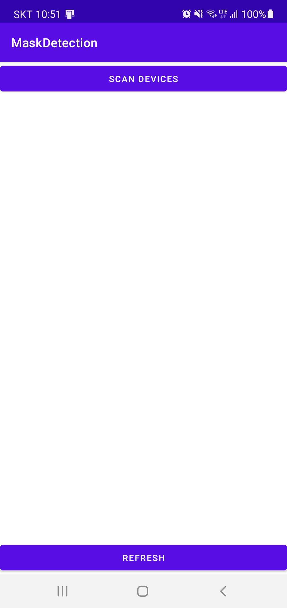
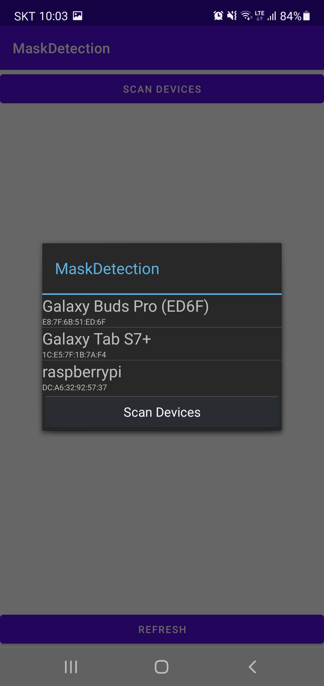
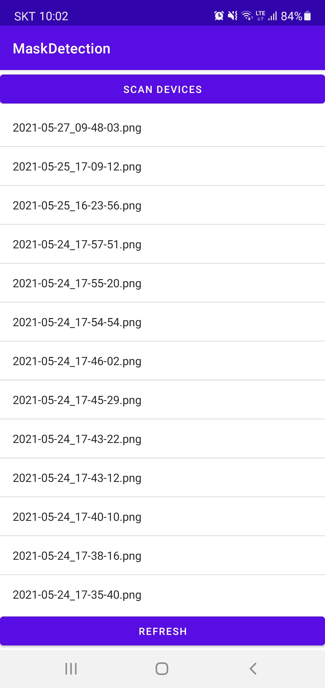
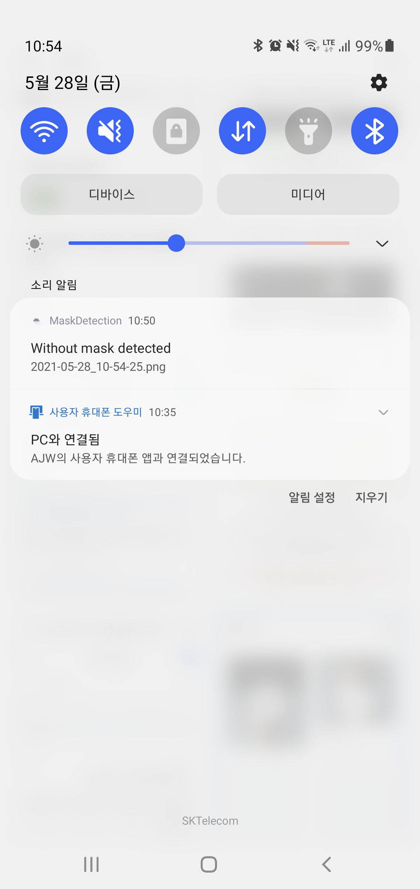
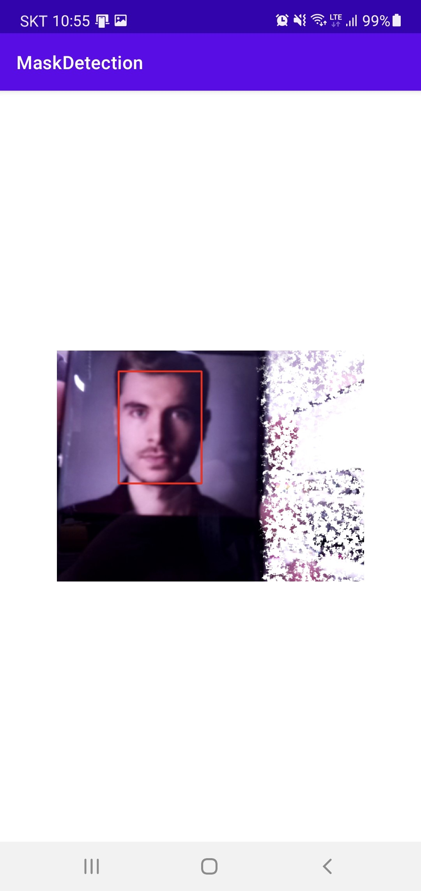

# alertWithoutMaskDetected
Detect person without mask using PiCam and send notify, image to Android device connected with bluetooth.

## Table of contents
* [About Project](#about-project)
* [Built with](#built-with)
* [Project result](#project-result)
* [Environment](#environment)
* [How to use](#how-to-use)
* [References](#references)

<!-- ABOUT PROJECT -->
## About Project
This project provide user to monitor who doesn't wear mask.<br>
Raspberry pi start monitoring on boot, and save image of non-weared person.<br>
User using android phone can connect to RPi with bluetooth, and can read non-weared person list.<br>
Android gets notify when non-weared person detected only the application is running on background.<br>

<!-- BUILT WITH -->
## Built with
* [Android](https://developer.android.com)
* [Python](https://www.python.org)

## Project result
When you run application, you can see this screen.
<p></p>

You can scan and connect to device with 'Scan devices' button.
<p></p>

Touch 'Refresh' button to get image list when connected.
<p></p>

If the application is running on background, it sends notify when non-wear person has detected.
<p></p>

You can see image when you touch item of image list or notify.
<p></p>

## Environment
* Client: Samsung Galaxy Note 10+ (OS Version 11)
* Server: Raspberry Pi 4

<!-- HOW TO USE -->
## How to use
This repository has 2 additional branches for update Android, Python code.<br>
Switch to specified branch to get code you need and build it to modify.<br>
Add this line to /etc/rc.local to run server application on boot.<br>
```
su pi -c "/usr/bin/python3 /home/pi/face_mask_detection/detect_mask_picam.py>/home/pi/face_mask_detection/errorLog.txt 2>&1" &
```

<!-- REFERENCES -->
## References
This project was developed with reference to <!--[Caroline Dunn](https://github.com/carolinedunn)'s face-mask-detection.-->
* [Caroline Dunn's Face mask detection](https://github.com/carolinedunn/Face_Mask_Detection)
* [Mask detection full tutorial](https://www.tomshardware.com/how-to/raspberry-pi-face-mask-detector)
* [Android BluetoothChat Example](https://github.com/android/connectivity-samples/tree/main/BluetoothChat)
